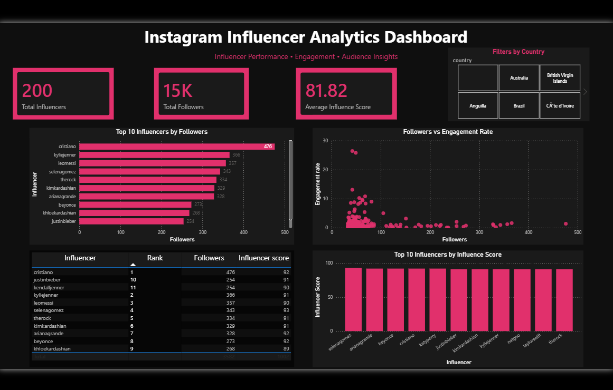

# 📊 Instagram Influencer Analytics Dashboard

## 📌 Project Overview
This project presents an interactive dashboard built using Power BI to analyze Instagram influencer data. It focuses on understanding influencer performance, follower distribution, and engagement trends.

## 🛠️ Tools & Technologies
- Microsoft Power BI
- CSV Dataset
- Data Cleaning & Transformation

## 📷 Dashboard Preview

## 📊 Key Features
- KPI Cards showing:
  - Total Influencers
  - Total Followers
  - Average Influence Score
- Top 10 Influencers by Followers
- Followers vs Engagement Rate (Scatter Plot)
- Top Influencers by Influence Score
- Interactive Table with influencer rankings
- Country-based Slicer for filtering

## 🔍 Key Insights
- Influencers with high followers do not always have high engagement.
- Some mid-level influencers show better engagement rates than top influencers.
- Influence Score provides a more balanced metric than follower count alone.
- Engagement tends to decrease as follower count increases.

## 🎯 Conclusion
This dashboard helps in identifying high-performing influencers and understanding audience engagement patterns, which can be useful for marketing and brand collaborations.

## 📁 Files Included
- `Instagram_Dashboard.pbix` – Power BI dashboard file
- `top_insta_influencers_data.csv` – Dataset used
- `Instagram_dashboard.png` – Dashboard preview image

## 🚀 How to Use
1. Download the `.pbix` file
2. Open it using Microsoft Power BI Desktop
3. Interact with filters and visuals

## 💡 Author
Created as part of a data analytics learning project.
